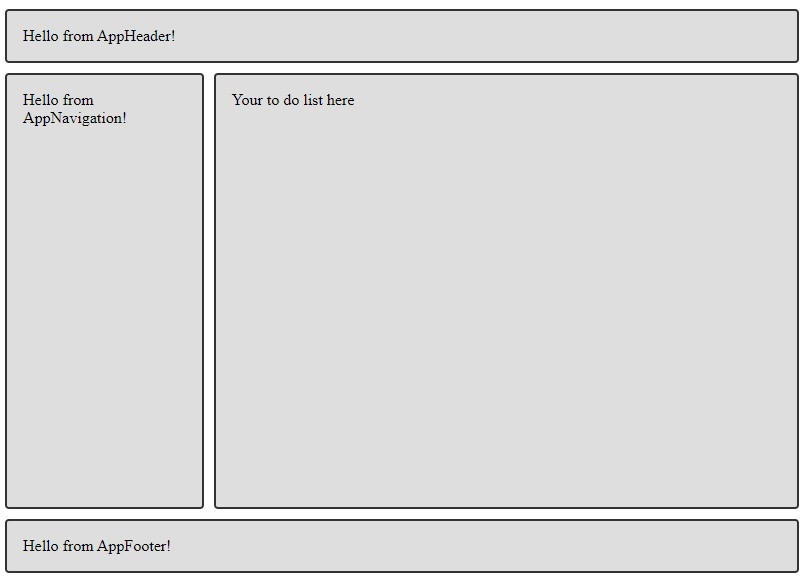

# 08 - Your App in Web Components

## Exercise 01

In de `componenten` directory zijn een aantal componenten aangemaakt. Vul de componenten `to-do-list` en `to-do-item` aan met de code uit de vorige les. De overige componenten bevatten geen functionaliteit, maar worden op dit moment enkel gebruikt voor het maken van de layout.

Geef de pagina een grid layout door gebruik te maken van CSS grid en `grid-template-areas`. Zorg ervoor ervoor dat de layout er als volgt uit komt te zien:

